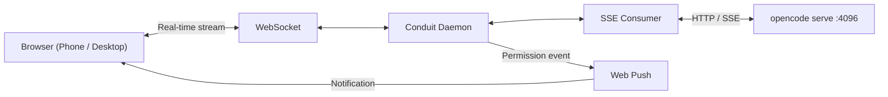

# Conduit

<p align="center">
  
</p>

<h3 align="center">Browser UI for OpenCode. Any device, one command.</h3>

[](https://github.com/dibstern/conduit/actions/workflows/ci.yml) [](https://www.npmjs.com/package/conduit-code) [](https://www.npmjs.com/package/conduit-code) [](https://github.com/dibstern/conduit) [](https://github.com/dibstern/conduit/blob/main/LICENSE)

Conduit connects to `opencode serve` and streams your session to a browser.
Phone, tablet, desktop — anything on your local network. Scan the QR code. Done.

The part worth setting up for: when OpenCode needs permission to run something,
you get a push notification. Tap Allow. OpenCode continues. You don't need to
be at your desk.

---

## Getting started

```bash
# Requires: opencode serve (running on port 4096)
npx conduit-code
```

<p align="center">
  
</p>

First run opens a setup wizard: set a port and PIN, optionally enable HTTPS,
scan the QR code with your phone. About two minutes.

For access beyond your local network, [Tailscale](https://tailscale.com) is
the cleanest option — encrypted tunnel, no port forwarding, free for personal
use.

---

## Approve from your phone

<p align="center">
  
</p>

OpenCode pauses on every tool permission request. Conduit sends a push
notification — tap **Allow** or **Deny** from wherever you are.

Open browser tabs get a blinking favicon and title change. Sound alerts are
optional.

---

## Full OpenCode UI in any browser

<p align="center">
  
</p>

Chat history, tool output with diff rendering, file browser with live reload,
xterm.js terminal tabs, session forking, slash command autocomplete, todo
progress overlay. The complete interface — on a phone screen or a 4K monitor.

OpenCode's agent and model selectors are in the header. Mermaid diagrams render
as diagrams. Code blocks have syntax highlighting and copy buttons.

---

## One daemon, every project

```bash
cd ~/backend  && npx conduit-code    # registers project
cd ~/frontend && npx conduit-code    # adds to same daemon
```

<p align="center">
  
</p>

One port, all projects. Switch between registered sessions from the browser.
The daemon stays running after the terminal closes — sessions survive.

---

## Why Conduit?

| | tmux / SSH | ntfy / Pushover hooks | ngrok / tunnel | OpenCode Web | Clay | **Conduit** |
|---|---|---|---|---|---|---|
| Mobile UI | ❌ Raw terminal | ❌ Alert only | ❌ Raw terminal | ✅ Full GUI | ✅ Full GUI | ✅ Full GUI |
| Push notifications | ❌ | ✅ | ❌ | ❌ | ✅ | ✅ |
| One-tap approval | ❌ | ❌ No action UI | ❌ | ❌ | ✅ | ✅ |
| Stays on your network | ✅ | ✅ | ❌ Third-party relay | ✅ | ✅ | ✅ |
| Multi-project | ❌ | ❌ | ❌ | ✅ | ✅ | ✅ |
| Quick auth | N/A | N/A | N/A | ❌ Password each visit | N/A | ✅ PIN once |
| PWA / home screen | ❌ | ❌ | ❌ | ❌ | ✅ | ✅ |
| Works with any model | ❌ | ❌ | ❌ | ✅ | ❌ Claude only | ✅ |

<details>
<summary>Detailed comparisons</summary>

**Why not tmux + Termius?**
No push notifications. No way to approve OpenCode permissions without switching
back to the terminal. Raw terminal on a phone is painful to navigate.

**Why not adding notification hooks?**
Hooks with ntfy or Pushover get you alerts, but when the notification arrives
there's no approval UI — you're back in a terminal. Conduit gives you the
notification and the one-tap response in the same place.

**Why not ngrok or a tunnel service?**
Third-party servers see your traffic. Conduit stays on your local network
or Tailscale — nothing routes through an external service.

**Why not SSH + terminal on mobile?**
Raw terminal, no approval UI, no push notifications, no mobile-optimised
interface. You end up checking manually instead of getting notified.

**What about OpenCode's built-in web UI?**
OpenCode ships a web interface via `opencode web` that covers the core
experience well — sessions, model switching, multi-project with a project
picker, terminal attachment — and works with any model.

Where Conduit adds to the experience: push notifications, one-tap permission
approvals, and PWA install. On authentication, `opencode web` uses HTTP Basic
Auth — with a strong password this means re-entering credentials on every
visit, which gets tedious on mobile. Conduit uses a numeric PIN entered once
at startup, then stays authenticated. If you mostly work at your desk and
want a browser view, `opencode web` may be all you need.

**What about Clay (claude-relay)?**
Conduit exists because of [Clay](https://github.com/chadbyte/clay). I loved
what Clay did for Claude Code — a browser UI on any device, push
notifications, mobile approvals — and wanted the same experience for
[OpenCode](https://opencode.ai), where I could use any model and provider.
Much of Conduit's original implementation was built on Clay's approach, and
that foundation made this project possible.

Where the two diverge: Clay embeds the Claude Agent SDK and drives Claude Code
directly, while Conduit is a relay for `opencode serve`. If you use Claude
Code, Clay is the project you want. If you use OpenCode, Conduit brings that
same vision to your setup. I do plan, however, to add support for Claude Code
now that opencode doesn't officially support Claude subscription accounts
using OAuth.

</details>

---

## Features

<details>
<summary>Full feature list</summary>

**Notifications**
- Push notifications for approvals, completions, errors, and questions (HTTPS required)
- Favicon blink and tab title change when input is awaited
- Configurable sound alerts

**Sessions**
- Session persistence across reconnects, terminal closes, and daemon restarts
- Session forking — branch from any assistant message
- Draft persistence — unsent messages restored when you switch back

**Rendering**
- LCS-based diff rendering for file edits
- Mermaid diagram support with dark theme
- Syntax highlighting for 180+ languages with copy buttons
- Collapsible thinking blocks with streaming spinner

**Input**
- Slash command autocomplete with keyboard navigation and preview
- Image paste, drag-and-drop, and camera attachment
- Todo progress overlay — sticky, auto-hides on completion

**File and terminal**
- File browser with breadcrumbs, preview modal, and live reload on external changes
- xterm.js terminal tabs — multi-tab, rename, resize-aware, font resizing for easier mobile viewing, mobile special-key toolbar

**OpenCode-specific**
- Agent selector (Claude, custom agents)
- Model and provider picker with thinking level selector
- Question/ask-user response UI

**Mobile**
- PWA-installable — add to home screen, receive notifications without opening the browser
- Large approve and deny touch targets
- Camera attachment from mobile browser
- QR scan to connect instantly

**Server**
- Background daemon — persists after terminal close
- Multi-project support — single port, all registered projects
- PIN authentication (4–8 digits)
- HTTPS with auto-generated certificates via mkcert
- Keep-awake mode — prevents macOS sleep while sessions are active

</details>

---

## Push notifications (HTTPS setup)

Push requires HTTPS. One-time setup:

```bash
brew install mkcert && mkcert -install
```

Conduit generates certificates automatically on first run. The wizard
handles the rest. If push registration fails, check that your browser trusts
the certificate and that your phone can reach the address.

---

## Security

Conduit binds to `127.0.0.1` by default. Set `HOST=0.0.0.0` to expose on
your LAN. **Set a PIN.** Anyone on your network with the URL and PIN can access
your OpenCode session.

Do not expose this to the public internet. For remote access, use
[Tailscale](https://tailscale.com) or a VPN.

---

## FAQ

<details>
<summary>Common questions</summary>

**"Does my code leave my machine?"**
No. Conduit runs locally and relays between your browser and `opencode serve`.
Files stay on your machine. Only OpenCode's own API calls go out, same as the CLI.

**"Is this a terminal wrapper?"**
No. Conduit connects to OpenCode's HTTP/SSE API directly. It doesn't scrape
or parse terminal output.

**"Can I continue a CLI session in the browser?"**
Yes. Conduit picks up existing sessions from `opencode serve`. Switch between
the terminal and browser freely.

**"Does it work with my existing OpenCode config?"**
Yes. Agents, models, MCP servers, and project-level configuration all carry
over as-is.

**"Do I need mkcert for basic use?"**
No. Conduit works over plain HTTP on localhost. mkcert is only needed for
HTTPS, which is required for push notifications and LAN access.

**"What happens if the daemon crashes?"**
Sessions are owned by OpenCode (SQLite), not Conduit. Restart the daemon and
your sessions are still there. Conduit includes a crash counter that prevents
restart loops.

</details>

---

## CLI reference

```
npx conduit-code                                  Interactive setup + main menu
npx conduit-code --add .                          Register current directory
npx conduit-code --add /path                      Register project by path
npx conduit-code --remove                         Unregister current project
npx conduit-code --list                           List registered projects
npx conduit-code --status                         Show daemon status
npx conduit-code --stop                           Stop the daemon
npx conduit-code --pin <PIN>                      Set or update PIN
npx conduit-code --title <name>                   Set project display name
npx conduit-code -p, --port <port>                HTTP port (default: 2633)
npx conduit-code --oc-port <port>                 OpenCode port (default: 4096)
npx conduit-code --no-https                       Disable TLS
npx conduit-code -y, --yes                        Skip prompts, accept defaults
npx conduit-code --dangerously-skip-permissions   Bypass permission prompts (PIN required)
npx conduit-code --foreground                     Run in foreground (dev mode)
npx conduit-code --log-level <level>              error | warn | info | verbose | debug
npx conduit-code --log-format <format>            pretty | json
```

Environment variables: `OPENCODE_URL`, `HOST`, `CONDUIT_CONFIG_DIR`,
`OPENCODE_SERVER_PASSWORD`.

---

## Architecture

```
┌──────────┐  WebSocket  ┌──────────────────────┐  HTTP/SSE  ┌────────────────┐
│ Browser  │◄───────────►│ Conduit daemon       │◄──────────►│ opencode serve │
│          │             │ :2633                │            │ :4096          │
└──────────┘             └──────────────────────┘            └────────────────┘
```

Conduit is a stateless translation layer. OpenCode owns all state (SQLite).
The relay handles WebSocket lifecycle, event translation, PIN authentication,
TLS termination, and Web Push delivery.



---

## Requirements

- [OpenCode](https://opencode.ai) — `opencode serve` running (port 4096)
- Node.js 20.19+
- [mkcert](https://github.com/FiloSottile/mkcert) — push notifications (optional)
- [Tailscale](https://tailscale.com) — remote access beyond LAN (optional)

---

## Contributing

Bug fixes and typo corrections are welcome. For feature suggestions, please
open an issue first:
[github.com/dibstern/conduit/issues](https://github.com/dibstern/conduit/issues)

If you're using Conduit, let us know how in Discussions:
[github.com/dibstern/conduit/discussions](https://github.com/dibstern/conduit/discussions)

---

## Disclaimer

Independent project. Not affiliated with the OpenCode project or its authors. 

Conduit is provided "as is" without warranty of any kind. Users are responsible for complying with the terms of service of underlying AI providers (e.g., Anthropic, OpenAI) and all applicable terms of any third-party services. Features such as multi-user mode are experimental and may involve sharing access to API-based services. Before enabling such features, review your provider's usage policies regarding account sharing, acceptable use, and any applicable rate limits or restrictions. The authors assume no liability for misuse or violations arising from the use of this software.

## Future plans

- Automated version updates in the UI
- UI design improvements
- Claude Agent SDK integration (removing the need for Claude-specific workarounds)
- Edited-files UI with split and unified diff views
- Quota usage info panel
- Keyboard shortcuts
- Session rewind support - revert session state from the browser
- Automatic certificate download
- Code quality improvements and performance optimisations

---

## License

MIT
