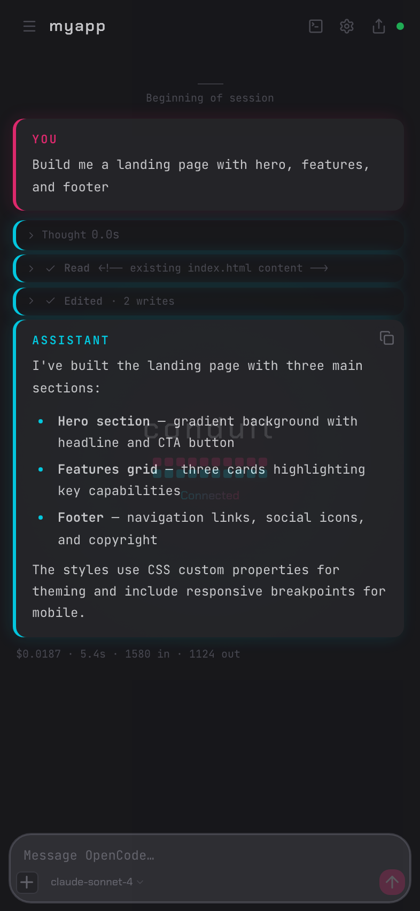
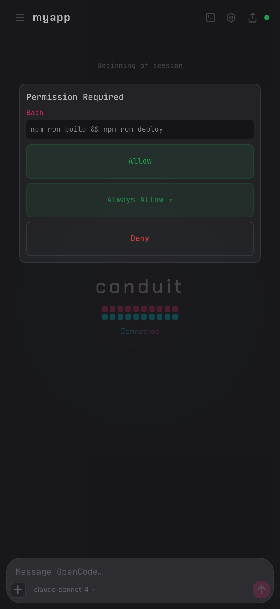
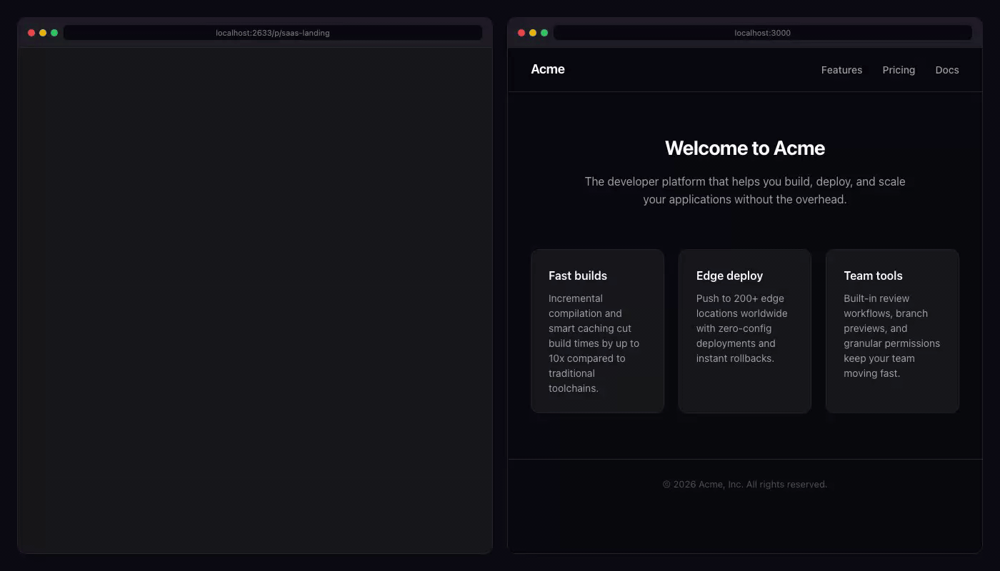
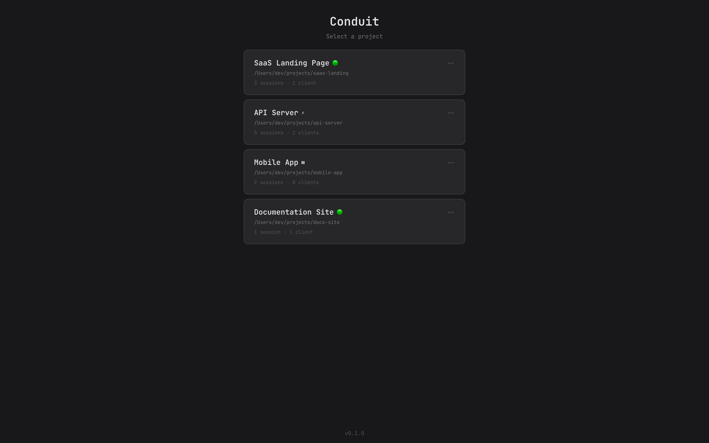
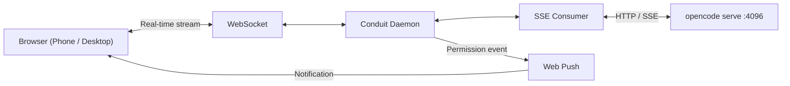

# Conduit

<p align="center">
  
</p>

> Web UI relay for [OpenCode](https://opencode.ai). Browser access from any
> device on your network. Push notifications when approval is needed.

```bash
npx conduit-code
```

Conduit connects to `opencode serve` and streams your session to a browser.
Phone, tablet, desktop — anything on your local network. Scan the QR code. Done.

The part worth setting up for: when OpenCode needs permission to run something,
you get a push notification. Tap Allow. OpenCode continues. You don't need to
be at your desk.

---

## Approve from your phone

<p align="center">
  
</p>

OpenCode pauses on every tool permission request. Conduit sends a push
notification — tap **Allow** or **Deny** from wherever you are.

Open browser tabs get a blinking favicon and title change. Sound alerts are
optional.

---

## Full OpenCode UI in any browser

<p align="center">
  
</p>

Chat history, tool output with diff rendering, file browser with live reload,
xterm.js terminal tabs, session forking, slash command autocomplete, todo
progress overlay. The complete interface — on a phone screen or a 4K monitor.

OpenCode's agent and model selectors are in the header. Mermaid diagrams render
as diagrams. Code blocks have syntax highlighting and copy buttons.

---

## One daemon, every project

```bash
cd ~/backend  && npx conduit-code    # registers project
cd ~/frontend && npx conduit-code    # adds to same daemon
```

<p align="center">
  
</p>

One port, all projects. Switch between registered sessions from the browser.
The daemon stays running after the terminal closes — sessions survive.

---

## Getting started

```bash
# Requires: opencode serve (running on port 4096)
npx conduit-code
```

<p align="center">
  
</p>

First run opens a setup wizard: set a port and PIN, optionally enable HTTPS,
scan the QR code with your phone. About two minutes.

For access beyond your local network, [Tailscale](https://tailscale.com) is
the cleanest option — encrypted tunnel, no port forwarding, free for personal
use.

---

## Features

<details>
<summary>Full feature list</summary>

**Notifications**
- Push notifications for approvals, completions, errors, and questions (HTTPS required)
- Favicon blink and tab title change when input is awaited
- Configurable sound alerts

**Sessions**
- Session persistence across reconnects, terminal closes, and daemon restarts
- Session forking — branch from any assistant message
- Rewind — revert session state from the browser
- Draft persistence — unsent messages restored when you switch back

**Rendering**
- LCS-based diff rendering for file edits
- Mermaid diagram support with dark theme
- Syntax highlighting for 180+ languages with copy buttons
- Collapsible thinking blocks with streaming spinner

**Input**
- Slash command autocomplete with keyboard navigation and preview
- Image paste, drag-and-drop, and camera attachment
- Todo progress overlay — sticky, auto-hides on completion

**File and terminal**
- File browser with breadcrumbs, preview modal, and live reload on external changes
- xterm.js terminal tabs — multi-tab, rename, resize-aware, mobile special-key toolbar

**OpenCode-specific**
- Agent selector (Claude, custom agents)
- Model and provider picker
- Question/ask-user response UI

**Mobile**
- PWA-installable — add to home screen, receive notifications without opening the browser
- Large approve and deny touch targets
- Camera attachment from mobile browser
- QR scan to connect instantly

**Server**
- Background daemon — persists after terminal close
- Multi-project support — single port, all registered projects
- PIN authentication (4–8 digits)
- HTTPS with auto-generated certificates via mkcert
- Keep-awake mode — prevents macOS sleep while sessions are active

</details>

---

## Push notifications (HTTPS setup)

Push requires HTTPS. One-time setup:

```bash
brew install mkcert && mkcert -install
```

Conduit generates certificates automatically on first run. The wizard
handles the rest. If push registration fails, check that your browser trusts
the certificate and that your phone can reach the address.

---

## Security

Conduit binds to `127.0.0.1` by default. Set `HOST=0.0.0.0` to expose on
your LAN. **Set a PIN.** Anyone on your network with the URL and PIN can access
your OpenCode session.

Do not expose this to the public internet. For remote access, use
[Tailscale](https://tailscale.com) or a VPN.

---

## CLI reference

```
conduit                                  Interactive setup + main menu
conduit --add .                          Register current directory
conduit --add /path                      Register project by path
conduit --remove                         Unregister current project
conduit --list                           List registered projects
conduit --status                         Show daemon status
conduit --stop                           Stop the daemon
conduit --pin <PIN>                      Set or update PIN
conduit --title <name>                   Set project display name
conduit -p, --port <port>                HTTP port (default: 2633)
conduit --oc-port <port>                 OpenCode port (default: 4096)
conduit --no-https                       Disable TLS
conduit -y, --yes                        Skip prompts, accept defaults
conduit --dangerously-skip-permissions   Bypass permission prompts (PIN required)
conduit --foreground                     Run in foreground (dev mode)
conduit --log-level <level>              error | warn | info | verbose | debug
conduit --log-format <format>            pretty | json
```

Environment variables: `OPENCODE_URL`, `HOST`, `CONDUIT_CONFIG_DIR`,
`OPENCODE_SERVER_PASSWORD`.

---

## Architecture

```
┌──────────┐  WebSocket  ┌──────────────────────┐  HTTP/SSE  ┌────────────────┐
│ Browser  │◄───────────►│ Conduit daemon   │◄──────────►│ opencode serve │
│          │             │ :2633                │            │ :4096          │
└──────────┘             └──────────────────────┘            └────────────────┘
```

Conduit is a stateless translation layer. OpenCode owns all state (SQLite).
The relay handles WebSocket lifecycle, event translation, PIN authentication,
TLS termination, and Web Push delivery.



---

## Why not X?

**Why not tmux + Termius?**
No push notifications. No way to approve OpenCode permissions without switching
back to the terminal. Raw terminal on a phone is painful to navigate.

**Why not adding notification hooks?**
Hooks with ntfy or Pushover get you alerts, but when the notification arrives
there's no approval UI — you're back in a terminal. Conduit gives you the
notification and the one-tap response in the same place.

**Why not ngrok or a tunnel service?**
Third-party servers see your traffic. Conduit stays on your local network
or Tailscale — nothing routes through an external service.

**Why not SSH + terminal on mobile?**
Raw terminal, no approval UI, no push notifications, no mobile-optimised
interface. You end up checking manually instead of getting notified.

---

## Requirements

- [OpenCode](https://opencode.ai) — `opencode serve` running (port 4096)
- Node.js 20.19+
- [mkcert](https://github.com/FiloSottile/mkcert) — push notifications (optional)
- [Tailscale](https://tailscale.com) — remote access beyond LAN (optional)

---

## Disclaimer

Independent project. Not affiliated with the OpenCode project or its authors.

## License

MIT
